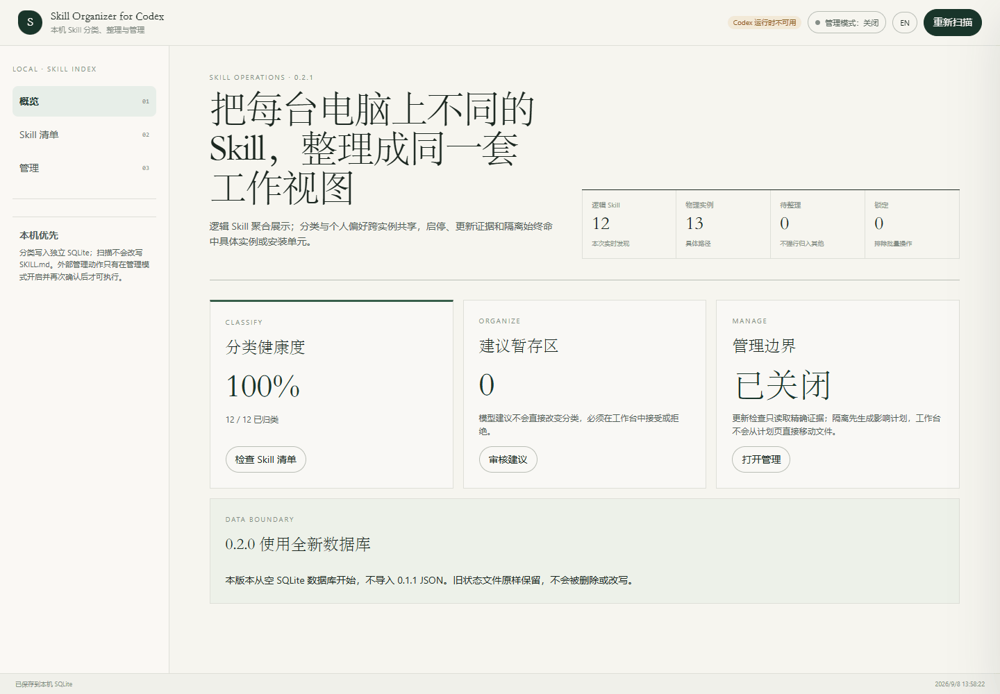

# 合成示例：真实工作台操作演示

拍摄日期：2026-09-08 · 应用源码：`039f7f4141eceed3b54fdf7c35cffa74808d83a5`（0.2.1）



GIF 由 6 张实际操作截图按顺序组成，约 15 秒循环播放，**不是逐帧录屏**。演示依次呈现概览、完整清单、搜索 `financial`、收藏结果、重新扫描后仍保留收藏，以及“研究与分析”分类下的两个条目。

- 所有 Skill 都是人工构造的合成示例，描述中带有 `[合成示例]`；12 个逻辑 Skill 对应 13 个物理实例，同一演示插件有两个缓存版本。
- 使用正式前端构建、实际扫描器、SQLite 与 HTTP 服务。仅 Codex runtime 被显式关闭，没有模拟“已连接 Codex”。
- 分类字段在示例 frontmatter 中预先给定。画面中的分类百分比用于展示界面，不能用作分类准确率评测。
- 工作台管理模式全程关闭，只在隔离数据库内收藏；未执行真实安装、启停、隔离、联网更新或个人目录扫描。
- 图片不含个人 Skill、真实账户、启动凭据或展开后的绝对文件路径。

[完整清单 PNG](workbench-inventory.png) · [概览 PNG](workbench-overview.png) · [分类与双实例 PNG](workbench-category.png)

## 在本地复现

需要 Node.js 24。在仓库根目录运行：

```powershell
npm ci
npm run build
node --import tsx scripts/showcase-demo.ts
```

脚本每次在 Git 忽略的 `artifacts/showcase/synthetic-*` 中新建技能目录与数据库；显式传入扫描根和 `appServer: null`，不会使用个人 Codex 配置。将本机生成的 `artifacts/showcase/launch-url.txt` 中的临时地址粘贴到浏览器。地址仅用于本机启动，不应分享或提交；按 `Ctrl+C` 停止服务。

本次使用独立 Chromium，视口为 1440 × 1000；通过界面完成搜索、收藏、重新扫描和分类筛选后截图，控制台未出现错误或警告。浏览器连接工具当时无可用会话，因此采用隔离 Playwright 会话，不连接用户浏览器。

可手工按上述操作复核：搜索结果应为 1 项，收藏后重扫仍显示实心星，“研究与分析”应显示 2 项且演示插件有 2 个实例。这只验证这些合成场景，不能代替完整桌面安装或真实 Codex 客户端验收。
